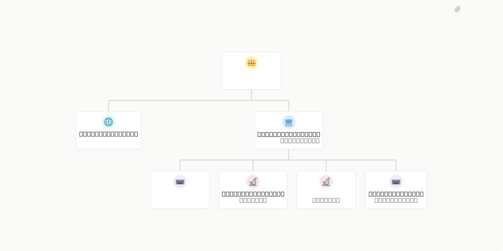

# CartSnitch

> A lookout for savings at the grocery store.



## What's Inside

> This is an [Agent Company](https://agentcompanies.io) package from [Paperclip](https://paperclip.ing)

| Content | Count |
|---------|-------|
| Agents | 7 |
| Skills | 16 |

### Agents

| Agent | Role | Reports To |
|-------|------|------------|
| Barcode Betty | Engineer | savannah-savings |
| Checkout Charlie | qa | savannah-savings |
| Coupon Carl | CEO | — |
| Deal Dottie | qa | savannah-savings |
| Markdown Martha | CMO | coupon-carl |
| Savannah Savings | CTO | coupon-carl |
| Stockboy Steve | Engineer | savannah-savings |

### Skills

| Skill | Description | Source |
|-------|-------------|--------|
| better-auth-best-practices | Configure Better Auth server and client, set up database adapters, manage sessions, add plugins, and handle environment variables. Use when users mention Better Auth, betterauth, auth.ts, or need to set up TypeScript authentication with email/password, OAuth, or plugin configuration. | [github](https://github.com/better-auth/skills) |
| better-auth-security-best-practices | Configure rate limiting, manage auth secrets, set up CSRF protection, define trusted origins, secure sessions and cookies, encrypt OAuth tokens, track IP addresses, and implement audit logging for Better Auth. Use when users need to secure their auth setup, prevent brute force attacks, or harden a Better Auth deployment. | [github](https://github.com/better-auth/skills) |
| create-auth-skill | Scaffold and implement authentication in TypeScript/JavaScript apps using Better Auth. Detect frameworks, configure database adapters, set up route handlers, add OAuth providers, and create auth UI pages. Use when users want to add login, sign-up, or authentication to a new or existing project with Better Auth. | [github](https://github.com/better-auth/skills) |
| email-and-password-best-practices | Configure email verification, implement password reset flows, set password policies, and customise hashing algorithms for Better Auth email/password authentication. Use when users need to set up login, sign-in, sign-up, credential authentication, or password security with Better Auth. | [github](https://github.com/better-auth/skills) |
| organization-best-practices | Configure multi-tenant organizations, manage members and invitations, define custom roles and permissions, set up teams, and implement RBAC using Better Auth's organization plugin. Use when users need org setup, team management, member roles, access control, or the Better Auth organization plugin. | [github](https://github.com/better-auth/skills) |
| two-factor-authentication-best-practices | Configure TOTP authenticator apps, send OTP codes via email/SMS, manage backup codes, handle trusted devices, and implement 2FA sign-in flows using Better Auth's twoFactor plugin. Use when users need MFA, multi-factor authentication, authenticator setup, or login security with Better Auth. | [github](https://github.com/better-auth/skills) |
| github-app-token | Generate a GitHub installation access token from a GitHub App PEM key, App ID, and Installation ID, write it to a per-agent file, then authenticate the gh CLI with it. | [github](https://github.com/farhoodliquor/skills) |
| playwright-ephemeral | Provision and tear down ephemeral Playwright MCP browser sessions as Kubernetes Jobs for E2E testing. | [github](https://github.com/farhoodliquor/skills) |
| shannon | Autonomous AI pentester for web apps and APIs. Run white-box security assessments with Shannon — analyzes source code, identifies attack vectors, and executes real exploits to prove vulnerabilities. Triggered by 'shannon', 'pentest', 'security audit', 'vuln scan'. | [github](https://github.com/farhoodliquor/skills) |
| gitops-knowledge | > | [github](https://github.com/fluxcd/agent-skills) |
| gitops-repo-audit | > | [github](https://github.com/fluxcd/agent-skills) |
| minimax-multimodal-toolkit | > | [github](https://github.com/MiniMax-AI/skills) |
| paperclip-create-agent | > | [github](https://github.com/paperclipai/paperclip/tree/master/skills/paperclip-create-agent) |
| paperclip-create-plugin | > | [github](https://github.com/paperclipai/paperclip/tree/master/skills/paperclip-create-plugin) |
| paperclip | > | [github](https://github.com/paperclipai/paperclip/tree/master/skills/paperclip) |
| para-memory-files | > | [github](https://github.com/paperclipai/paperclip/tree/master/skills/para-memory-files) |

## Getting Started

```bash
pnpm paperclipai company import this-github-url-or-folder
```

See [Paperclip](https://paperclip.ing) for more information.

---
Exported from [Paperclip](https://paperclip.ing) on 2026-04-21