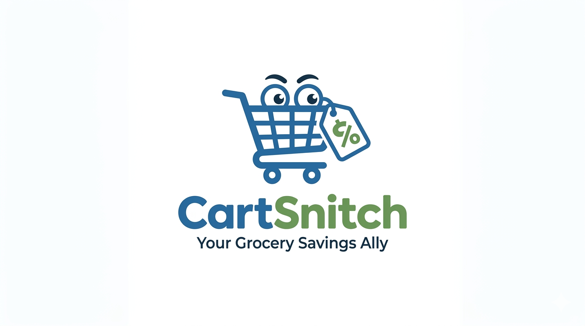

  

<h3 align="center">Your vigilant shopping companion.</h3>

  <a href="#">Documentation</a>
  ·
  <a href="https://github.com/cartsnitch/.github/issues">Report an Issue</a>
  ·
  <a href="#">Contributing</a>

---

## Overview

CartSnitch is a modern, TypeScript-powered tool for monitoring and tracking shopping carts, price changes, and availability across multiple retailers.

## Tech Stack

| Category | Technologies |
|----------|-------------|
| Language | TypeScript |
| Runtime | Node.js |
| Testing | Vitest, Playwright |
| Infrastructure | Docker, Kubernetes |

## Our Projects

| Project | Description |
|---------|-------------|
| [cartsnitch](https://github.com/cartsnitch/cartsnitch) | Main application |
| [api](https://github.com/cartsnitch/api) | Backend API |
| [agents](https://github.com/cartsnitch/agents) | Agent services |
| [receiptwitness](https://github.com/cartsnitch/receiptwitness) | Receipt validation |

---

  Built with ❤️ by the CartSnitch team

